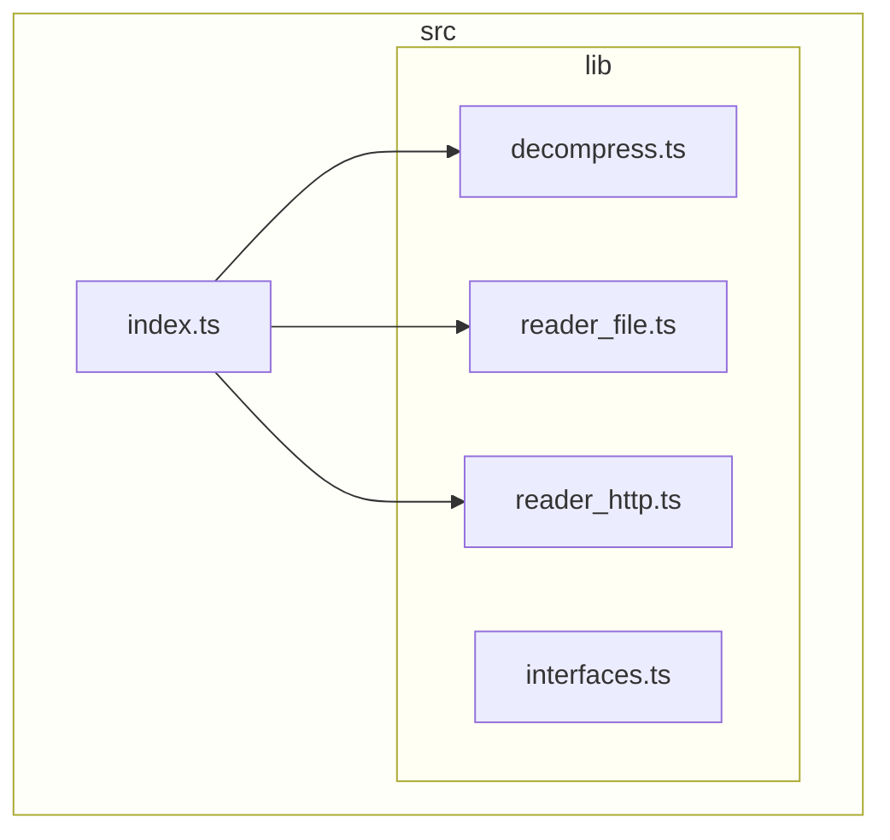

[](https://codecov.io/gh/versatiles-org/node-versatiles-container)
[](https://github.com/versatiles-org/node-versatiles-container/actions/workflows/ci.yml)

A client library for [VersaTiles containers](https://github.com/versatiles-org/versatiles-spec).

# Install

`npm i @versatiles/container`

# Usage Example

```js
import { Container } from "@versatiles/container";
import fs from "fs";

const container = new Container("https://example.org/planet.versatiles");
const header = await container.getHeader();
const tile = await container.getTileUncompressed(z, x, y);
fs.writeFileSync("tile." + header.tileFormat, tile);
```

# API

You can find a complete documentation of the API at
<https://versatiles.org/node-versatiles-container/>

## Dependency Graph

<!--- This chapter is generated automatically --->



# License

[Unlicense](./LICENSE)
