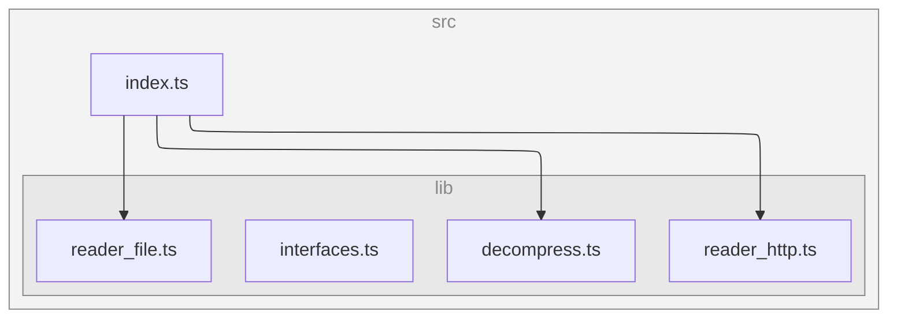

[](https://www.npmjs.com/package/@versatiles/container)
[](https://www.npmjs.com/package/@versatiles/container)
[](https://codecov.io/gh/versatiles-org/node-versatiles-container)
[](https://github.com/versatiles-org/node-versatiles-container/actions/workflows/ci.yml)
[](LICENSE)

A client library for [VersaTiles containers](https://github.com/versatiles-org/versatiles-spec).

# Install

`npm i @versatiles/container`

Requires Node.js 22.15 or newer, since Zstandard decompression uses the built-in `node:zlib` zstd support.

# Usage Examples

## Basic: read a tile and write to disk

```ts
import { Container } from "@versatiles/container";
import fs from "fs";

const container = new Container("https://example.org/planet.versatiles");
const header = await container.getHeader();
const tile = await container.getTileUncompressed(z, x, y);
fs.writeFileSync("tile." + header.tileFormat, tile);

// don't forget to close file-backed containers
await container.close();
```

## Inspect tile metadata

VersaTiles containers can carry JSON metadata describing vector tile layers:

```ts
import { Container } from "@versatiles/container";

const container = new Container("/path/to/layers.versatiles");

const header = await container.getHeader();
console.log("Format:", header.tileFormat);  // e.g. "pbf"
console.log("Compression:", header.tileCompression);
console.log("Zoom range:", header.zoomMin, "→", header.zoomMax);
console.log("Bounding box:", header.bbox);

const metadata = await container.getMetadata();
if (metadata) {
  const parsed = JSON.parse(metadata);
  console.log("Vector layers:", parsed.vector_layers?.length);
}

await container.close();
```

## Handle missing tiles

Coordinates must lie within the zoom level's grid (`0 <= x, y < 2 ** z`), otherwise `getTile` throws a `RangeError`. For a valid coordinate that simply has no data, the container returns `null`:

```ts
const tile = await container.getTileUncompressed(12, 100, 4000);
if (!tile) {
  console.log("Tile does not exist in this container");
}
```

## Custom reader (e.g. S3, in-memory)

For custom storage backends, implement the `Reader` interface:

```ts
import type { Reader } from "@versatiles/container";
import { Container } from "@versatiles/container";

const myReader: Reader = async (offset, length) => {
  // e.g. fetch from an S3 bucket or read from a typed array
  const buffer = Buffer.alloc(length);
  // … fill buffer with data starting at offset …
  return buffer;
};

const container = new Container(myReader);
const header = await container.getHeader();
```

# API

You can find a complete documentation of the API at
<https://versatiles.org/node-versatiles-container/>

## Dependency Graph

<!--- This chapter is generated automatically --->


```mermaid
---
config:
  layout: elk
---
flowchart TB

subgraph 0["src"]
1["index.ts"]
subgraph 2["lib"]
3["decompress.ts"]
4["reader_file.ts"]
5["reader_http.ts"]
6["interfaces.ts"]
end
end
1-->3
1-->4
1-->5

class 0,2 subgraphs;
classDef subgraphs fill-opacity:0.1, fill:#888, color:#888, stroke:#888;
```

# License

[Unlicense](./LICENSE)
